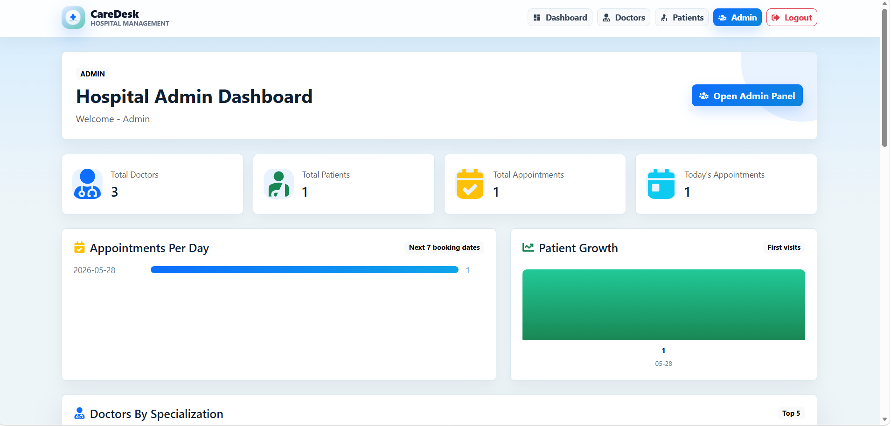
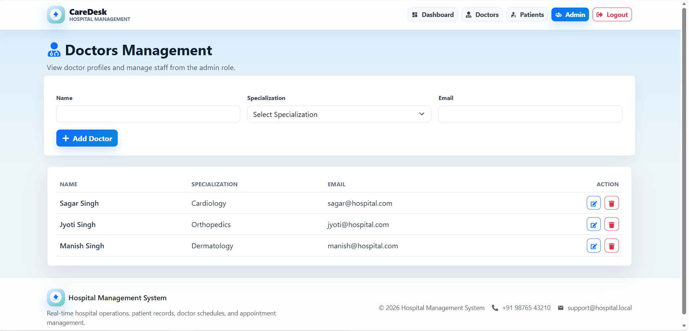
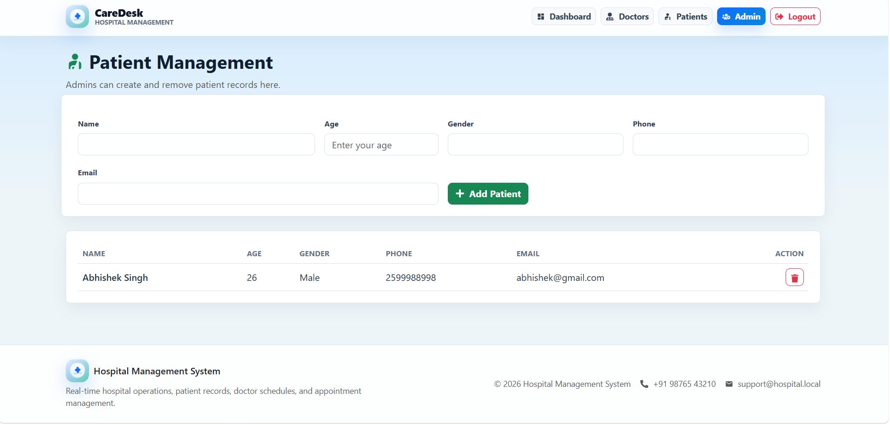
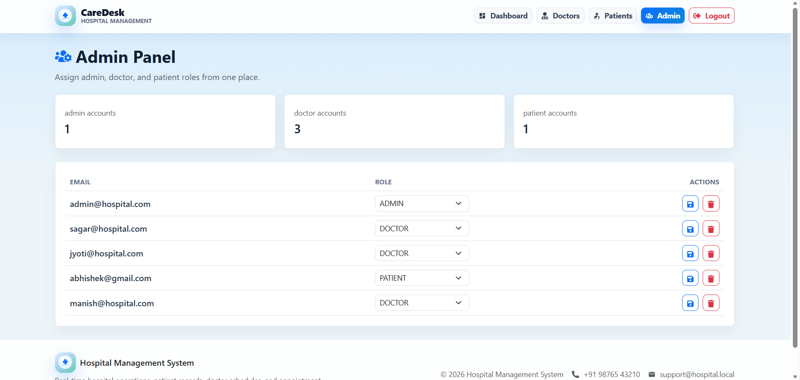
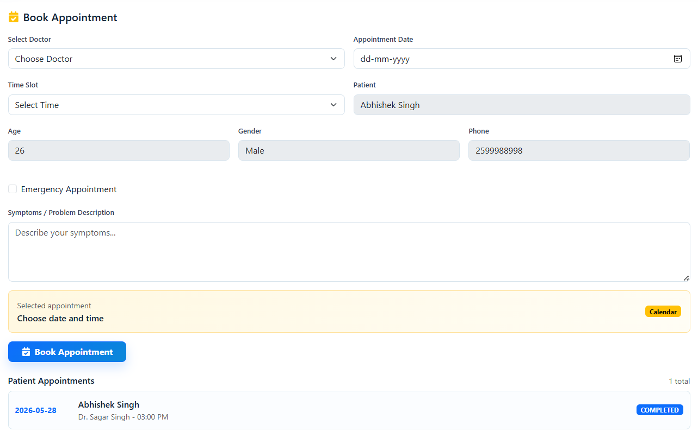

# Hospital Management System

A production-ready full-stack Hospital Management System with secure JWT authentication, role-based dashboards, and real-time appointment management.

🚀 Built using Spring Boot + React (Vite)

## 💡 Why This Project?

This project was built to simulate real-world hospital workflows and demonstrate full-stack development skills including authentication, role-based access control, and REST API design.

## 🧠 System Architecture

Frontend (React + Redux) → REST API (Spring Boot) → MySQL Database  
Authentication handled via JWT tokens

## Screenshots

### Dashboard



### Doctor Management



### Patient Management



### Admin Panel



### Book Appointment



## Features

- User registration and login with JWT authentication
- Role-based access for Admin, Doctor, and Patient users
- Admin panel for user and role management
- Doctor management with create, update, list, and delete operations
- Patient management with protected patient records
- Appointment booking and appointment tracking
- Doctor-specific panel for viewing assigned patients
- Responsive frontend built with React, Redux Toolkit, Bootstrap, and React Router

## Tech Stack

**Frontend**

- React 19
- Vite
- React Router
- Redux Toolkit
- Axios
- Bootstrap
- React Icons

**Backend**

- Java 21
- Spring Boot 3.3.5
- Spring Web
- Spring Security
- Spring Data JPA
- MySQL
- JWT
- Maven

## Project Structure

```text
.
├── hospital-management-backend/
│   └── hospital-management-system/
│       ├── src/main/java/com/hospital/management/system/
│       │   ├── controller/
│       │   ├── dto/
│       │   ├── entity/
│       │   ├── exception/
│       │   ├── repository/
│       │   ├── security/
│       │   └── service/
│       ├── src/main/resources/application.properties
│       └── pom.xml
│
└── hospital-management-frontend/
    └── hospital-management-system/
        ├── src/components/
        ├── src/pages/
        ├── src/services/
        ├── src/store/
        └── package.json
```

## Prerequisites

Install the following before running the project:

- Java 21 or higher
- Maven, or use the included Maven wrapper
- Node.js and npm
- MySQL Server

## Backend Setup

1. Open the backend folder:

```bash
cd hospital-management-backend/hospital-management-system
```

2. Create a MySQL database, or let Spring create it automatically:

```sql
CREATE DATABASE hospital_management_db;
```

3. Configure environment variables if your MySQL credentials are different:

```bash
DB_URL=jdbc:mysql://localhost:3306/hospital_management_db?createDatabaseIfNotExist=true
DB_USERNAME=root
DB_PASSWORD=your_mysql_password
JWT_SECRET=your_secure_jwt_secret
```

4. Start the backend:

```bash
./mvnw spring-boot:run
```

On Windows:

```bash
mvnw.cmd spring-boot:run
```

The backend runs on:

```text
http://localhost:8080
```

## Frontend Setup

1. Open the frontend folder:

```bash
cd hospital-management-frontend/hospital-management-system
```

2. Install dependencies:

```bash
npm install
```

3. Start the development server:

```bash
npm run dev
```

The frontend runs on:

```text
http://localhost:5173
```

## Available Scripts

Run these commands from the frontend folder:

```bash
npm run dev
npm run build
npm run lint
npm run preview
```

Run these commands from the backend folder:

```bash
./mvnw spring-boot:run
./mvnw test
./mvnw clean package
```

## API Overview

| Module | Endpoint |
| --- | --- |
| Authentication | `/auth/register`, `/auth/login`, `/auth/emails` |
| Admin | `/api/admin/users`, `/api/admin/users/{id}/role` |
| Doctors | `/api/doctors`, `/api/doctors/{id}`, `/api/doctors/me/patients` |
| Patients | `/api/patients`, `/api/patients/{id}`, `/api/patients/me` |
| Appointments | `/api/appointments`, `/api/appointments/{id}` |

Protected endpoints require a JWT token in the request header:

```text
Authorization: Bearer <token>
```

## Environment Variables

| Variable | Description | Default |
| --- | --- | --- |
| `DB_URL` | MySQL connection URL | `jdbc:mysql://localhost:3306/hospital_management_db?createDatabaseIfNotExist=true` |
| `DB_USERNAME` | MySQL username | `root` |
| `DB_PASSWORD` | MySQL password | `root` |
| `JWT_SECRET` | Secret key used for JWT signing | Local development secret |

## 🔗 Repository

https://github.com/Sumitsingh6923/hospital-management-system

## 👨‍💻 Author

**Sumit Singh**  
GitHub: https://github.com/Sumitsingh6923
